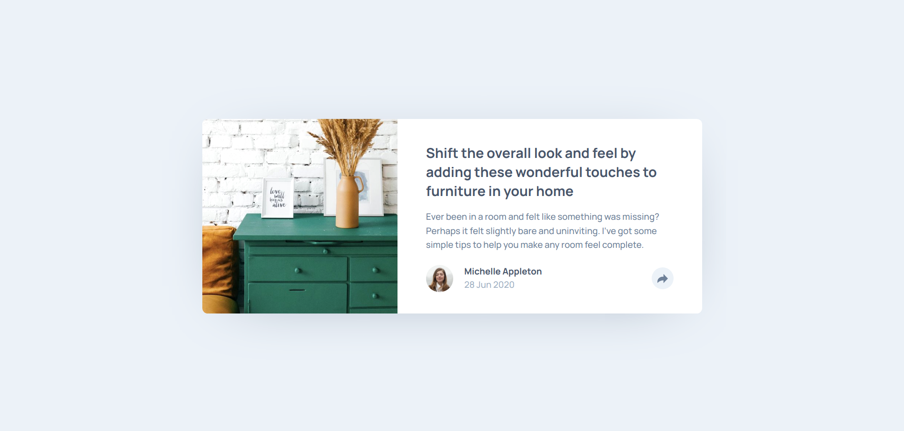

# Frontend Mentor - Article preview component solution

This is a solution to the [Article preview component challenge on Frontend Mentor](https://www.frontendmentor.io/challenges/article-preview-component-dYBN_pYFT). Frontend Mentor challenges help you improve your coding skills by building realistic projects.

## Table of contents

- [Overview](#overview)
  - [The challenge](#the-challenge)
  - [Screenshot](#screenshot)
  - [Links](#links)
- [My process](#my-process)
  - [Built with](#built-with)
  - [What I learned](#what-i-learned)
  - [Continued development](#continued-development)
  - [Useful resources](#useful-resources)
- [Author](#author)
- [Acknowledgments](#acknowledgments)

**Note: Delete this note and update the table of contents based on what sections you keep.**

## Overview

### The challenge

Users should be able to:

- View the optimal layout for the component depending on their device's screen size
- See the social media share links when they click the share icon

### Screenshot

### Links

- Solution URL: [GitHub](https://github.com/marisudris/frontend-mentor-article-preview-component)
- Live Site URL: [GitHub Pages](https://marisudris.github.io/frontend-mentor-article-preview-component/)

## My process

First I developed a semantic and accessible HTML structure with BEM class names for easy styling hooks.  
Afterwards I proceeded mobile styles using a top-down approach - major layouts first and details after. Then I did the desktop styles in similar fashion - layout first and the details (mostly just re-adjusting spacing) later.
Then I styled the toggletip for both mobile and desktop, and added the necessary behaviors - taking the accessibility into account after researching which ARIA attributes apply.

### Built with

- Semantic HTML5 markup
- CSS custom properties
- Flexbox
- CSS Grid
- Mobile-first workflow
- ARIA

### What I learned

Designing the behavior with accessibility in mind is crucial and can be a bit difficult for a beginner. Determining what ARIA attributes go where and how to merge the, with the behavior can be a little confusing, however there are a plenty of examples and beginner friendly-resources out there. Sometimes it's hard to properly determine roles for your widgets. I named my widget a _toggletip_ in BEM even though it really isn't a pure toggletip (which normally only gives additional info after getting clicked/tapped, rather than opening an interactive menu). I took that into account when determining what ARIA attributes to use - here I went to something similar as with navigation + a hamburger menu.

### Continued development

I plan on doing a deep-dive into ARIA and accessible design in order to streamline my widget development in the future by getting familiar with the most common solutions.

### Useful resources
- [Inclusive Components](https://inclusive-components.design/) - by [Heydon Pickering](https://heydonworks.com/latest/). A useful resource on different accessibility solutions for common design problems.
- [Sara Soueidan](https://www.sarasoueidan.com/blog/) - A great blog on accessible UX and design as well.

## Author

- Frontend Mentor - [@marisudris](https://www.frontendmentor.io/profile/marisudris)
- GitHub - [@marisudris](https://www.github.com/marisudris)

## Acknowledgments

Shout-out to [Heydon Pickering](https://heydonworks.com/latest/) and his post on [tooltips & toggleips](https://inclusive-components.design/tooltips-toggletips/) - even though I didn't use the given solutions straight away - it helped clear some confusion for me.
